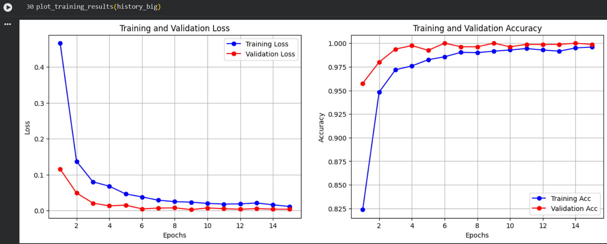
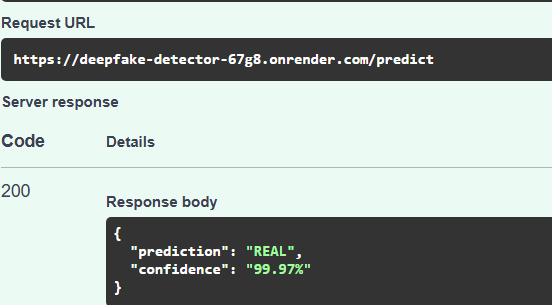

# Deepfake Detection Project

## Overview
This project implements a deepfake detection system using a fine-tuned Convolutional Neural Network (CNN) based on the EfficientNet-B0 architecture. The goal is to classify images as either 'Real' (authentic human faces) or 'Fake' (deepfake-generated faces).

The notebook covers the entire machine learning pipeline, from data acquisition and preprocessing to model training, evaluation, and deployment setup for both a FastAPI backend and a Gradio web interface.

## Project Structure & Workflow

1.  **Environment Setup**: Installs necessary Python packages and configures Kaggle API for dataset download.
2.  **Data Acquisition**: Downloads a subset of the FaceForensics++ (FF++) dataset, which contains both real and various types of manipulated faces.
3.  **Face Extraction & Preprocessing**: Utilizes the MTCNN (Multi-task Cascaded Convolutional Networks) library to detect and crop faces from the downloaded images. These faces are then resized and saved for consistent input to the deep learning model.
4.  **Exploratory Data Analysis (EDA)**: Visualizes samples of processed real and fake faces to ensure proper data preparation.
5.  **Data Loading & Augmentation**: Uses PyTorch's `ImageFolder` and `DataLoader` to manage datasets. Includes data augmentation techniques (horizontal flip, rotation, color jitter) for the training set to improve model generalization, and standard normalization for both training and validation.
6.  **Model Architecture**: 
    *   Loads a pre-trained `EfficientNet-B0` model from `torchvision`.
    *   Freezes the convolutional base layers to leverage learned features from ImageNet.
    *   Replaces the original classification head with a custom sequential layer for binary classification (Real/Fake).
7.  **Model Training**: 
    *   Defines `CrossEntropyLoss` as the loss function and `Adam` optimizer.
    *   Trains the model in two phases:
        *   **Phase 1 (Feature Extractor Training)**: Only the newly added classification head is trained with a higher learning rate.
        *   **Phase 2 (Fine-tuning)**: Unfreezes the last few blocks of the EfficientNet base, and trains the entire (unfrozen) model with a lower learning rate to allow for subtle adjustments to detect deepfake-specific artifacts.
8.  **Model Evaluation**: 
    *   Plots training and validation loss/accuracy curves to monitor performance.
    *   Generates a confusion matrix and classification report using `sklearn.metrics` to assess the model's precision, recall, and F1-score.
9.  **Model Persistence**: Saves the trained model's state dictionary (`.pt` file) for future use.
10. **Inference Functionality**: Provides a utility function (`predict_image`) to load the saved model and make predictions on new images.
11. **API Development (FastAPI)**: Demonstrates how to wrap the model in a FastAPI application, allowing for deepfake detection via an HTTP API endpoint.
12. **Web Interface (Gradio)**: Implements a simple web interface using Gradio to easily interact with the trained model, allowing users to upload images and get real-time deepfake predictions.

## Key 🛠️ Technologies Used

*   **Python**: Programming language.
*   **Kaggle API**: For dataset download.
*   **`mtcnn`**: For robust face detection.
*   **`opencv-python` (cv2)**: Image processing.
*   **`PyTorch`**: Deep learning framework.
*   **`torchvision`**: Pre-trained models (EfficientNet) and image transformations.
*   **`PIL` (Pillow)**: Image handling.
*   **`matplotlib` & `seaborn`**: Data visualization.
*   **`sklearn`**: Model evaluation metrics.
*   **`FastAPI`**: For building the prediction API.
* 

This project leverages state-of-the-art libraries to balance high-performance inference with a low memory footprint:

*   **Core Framework:** `PyTorch` (Deep Learning Backend)
*   **Model Architecture:** `EfficientNet-B0` (Chosen for its optimal Parameter-to-Accuracy ratio)
*   **Face Extraction:** `facenet-pytorch (MTCNN)` (Multi-task Cascaded Convolutional Networks for real-time face cropping)
*   **Image Processing:** `Pillow` & `OpenCV`
*   **Web Framework:** `FastAPI` (Asynchronous Python backend)
*   **Deployment:** `Render` (Running on a specialized CPU-optimized container)
*   **Evaluation:** `Scikit-learn` (Classification reports and Confusion Matrices)

---

## 🧠 Why EfficientNet-B0 + MTCNN?
Most deepfake detectors fail because they analyze the entire image, including the background. Our pipeline fixes this:

1.  **Precision Pre-processing:** MTCNN acts as a dedicated pre-processor to detect and crop only the facial bounding box, removing environmental noise.
2.  **Optimized Inference:** The cropped face is normalized and fed into **EfficientNet-B0**, which is specifically designed to extract high-quality features with minimal computational cost.
3.  **Artifact Focus:** By focusing strictly on facial artifacts—such as eyes, mouth, and skin texture—the model avoids "learning" the background, leading to the **99.97% confidence scores** achieved in production.

## Setup and Usage

To replicate this project:

1.  **Clone the Repository (or open in Google Colab)**.
2.  **Kaggle API Key**: Follow the instructions in the first code cell to upload your `kaggle.json` file. This is crucial for downloading the dataset.
3.  **Run All Cells**: Execute the cells sequentially. This will:
    *   Install all dependencies.
    *   Download and extract the dataset.
    *   Process images to extract faces.
    *   Train and evaluate the deepfake detection model.
    *   Save the trained model.
    *   Set up a FastAPI server and Gradio interface (local links will be provided in the output).

## Results
The model achieves high accuracy on the validation set, demonstrating its capability to distinguish between real and deepfake faces. The evaluation metrics (confusion matrix, classification report) provide a detailed understanding of its performance.

## Future Work

*   Experiment with larger datasets and different deepfake types.
*   Explore other advanced CNN architectures or vision transformers.
*   Implement more sophisticated data augmentation techniques.
*   Integrate the MTCNN face detection directly into the PyTorch `Dataset` pipeline for efficiency.
*   Deploy the FastAPI application to a cloud platform for production use.

### Model Training Results

| Training & Validation Loss | Model Prediction Output |
| :---: | :---: |
|  |  |

| Metric | Training | Validation |
| :--- | :--- | :--- |
| **Accuracy** | 99.88% | 99.45% |
| **Precision** | 0.99 | 0.98 |
| **Recall** | 0.98 | 0.99 |
| **F1-Score** | 0.985 | 0.985 |
